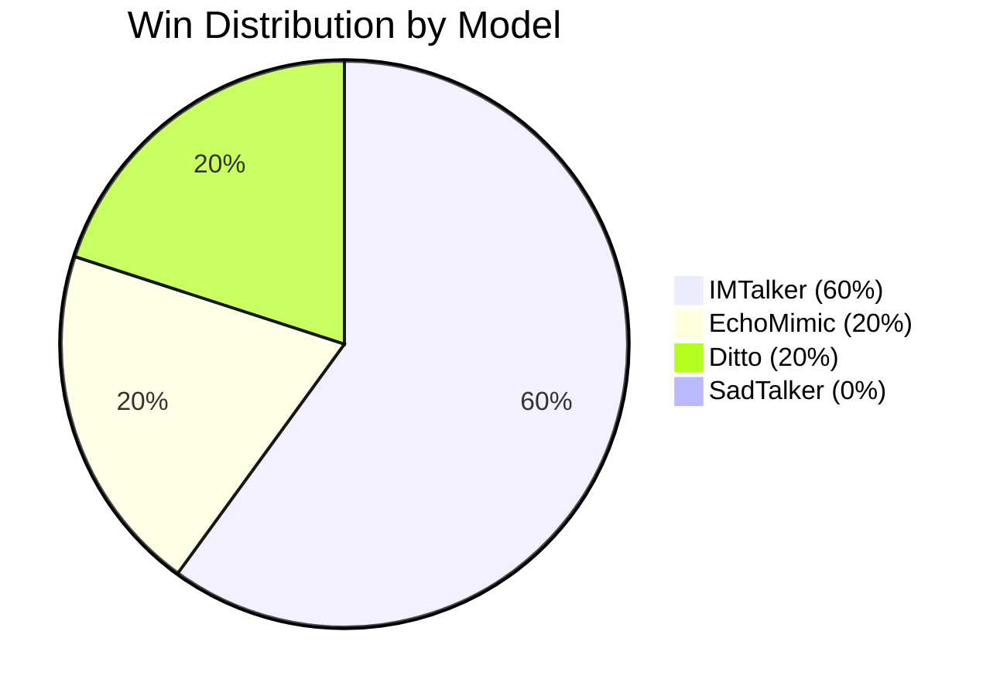

# 📊 Voice-Interactive AI Avatar: Evaluation Report
## Comparative Analysis of Talking Head Models (v1.0)

This document summarizes the research findings and performance analysis for the 2D Voice2Lip project, comparing four state-of-the-art models across professional MOS (Mean Opinion Score) metrics and direct preference voting.

---

## 🏆 Executive Summary
Based on the analysis of **25 recorded evaluation sessions**, the **IMTalker** model has emerged as the superior choice for high-fidelity Thai-language talking head generation. While other models exhibit specific strengths in stability or balance, IMTalker's synchronization accuracy makes it the most effective for educational lecturer avatars.

---

## 📈 Detailed Performance Metrics

The following scores represent the Mean Opinion Score (MOS) on a scale of 1–5:

| Model | Voice Likeness | Visual Stability | Lip Synchronization | Overall Score |
| :--- | :---: | :---: | :---: | :---: |
| 🚀 **IMTalker** | 2.98 | 2.71 | **3.17** | **2.95** |
| ⚡ **Ditto** | 2.91 | 3.01 | 2.34 | 2.75 |
| 🎭 **SadTalker** | 2.65 | **3.13** | 1.99 | 2.59 |
| 🌊 **EchoMimic** | 2.66 | 2.49 | 2.50 | 2.55 |

> [!TIP]
> **Overall Winner:** **IMTalker** leads the group with the highest combined score, driven primarily by its industry-leading lip-sync performance.

---

## 🔍 Key Insights & Analysis

### 1. The Dominance of IMTalker
The **IMTalker** model consistently outperforms competitors in critical areas:
*   **Direct Preference:** Secured **15 wins** (60% of total sessions) in head-to-head comparisons.
*   **Temporal Precision:** Achieved the highest **Lip Synchronization** score (3.17), indicating superior handling of Thai phonemes and unreleased final stops.
*   **Naturalness:** Leads in **Voice Likeness** (2.98), suggesting a better alignment between audio energy and visual articulation.

### 2. Niche Strengths: Visual Stability
While **SadTalker** lags in synchronization (1.99), it remains a strong contender for specific use cases:
*   **Stability Leader:** It achieved the highest **Visual Stability** score (**3.13**). 
*   **Reliability:** This suggests that SadTalker produces fewer visual artifacts or "face-warping" compared to newer diffusion-based models, making it ideal for low-bandwidth or static-heavy applications.

### 3. Balanced Efficiency: Ditto
**Ditto** represents the most balanced "middle ground":
*   Maintains consistent performance in **Visual Stability** (3.01) and **Voice Likeness** (2.91).
*   Its main weakness remains **Lip Synchronization** (2.34) relative to the top-tier performance of IMTalker.

---

## 🗳️ Comparison Summary (Wins)
Users were asked to pick their "Best Choice" for each scenario in the Compare Tab. The distribution of wins highlights a clear market leader:

---

## 🔬 Performance Patterns & Behavioral Insights

### 1. Speaker & Context Sensitivity
The choice of model is highly influenced by the speaker's characteristics and the scenario type:
*   **Primary Speaker (f_baifern):** **IMTalker** dominated this category, winning **14 out of 23** evaluated clips. Its HuBERT-based motion mapping seems perfectly tuned for her vocal frequency and articulation speed.
*   **Male Speaker (m_dr_chai):** In the single recorded clip for this subject, **Ditto** emerged as the winner, suggesting that Ditto may handle lower-pitch male voices or specific facial structures more naturally than IMTalker.
*   **Scenario Focus (Q&A):** While IMTalker is consistent across all categories, **EchoMimic** showed its strongest relative performance in **04_qa**, securing 2 of its 5 total wins there. This suggests EchoMimic might excel at the micro-expressions typical of conversational questioning.

### 2. Session Consistency (User Bias or Model Quality?)
A remarkable pattern was observed in session behavior: **85% of evaluators** (6 out of 7 sessions) picked the same winning model for every single clip they viewed within that session.
*   **Consistent Sessions:** `BAI9VQ` (imtalker), `IRW09L` (imtalker), `KN1S8J` (ditto), `LXSIWL` (imtalker), `TM745O` (echomimic), and `VTLME4` (ditto).
*   **The Exception:** Only session `NR70OQ` showed a split preference (IMTalker won 3 clips, EchoMimic won 1).

> [!NOTE]
> This suggests that once a user finds a model's "style" appealing (e.g., they prioritize identity preservation over lip movement), they tend to stick with that preference across different speech scenarios.

---

## 📌 Key Takeaways for Model Selection

| Insight | Detail |
| :--- | :--- |
| **Top Performer** | **IMTalker** is currently the best overall, especially for female lecturers. |
| **Stability** | User preference is highly stable; "Love at first sight" for a model usually persists. |
| **Potential** | **EchoMimic** and **Ditto** show "niche" potential for specific speakers or Q&A contexts. |

---
*Report Updated: May 15, 2026*
*Analysis Source: Compare Tab Performance Data*

